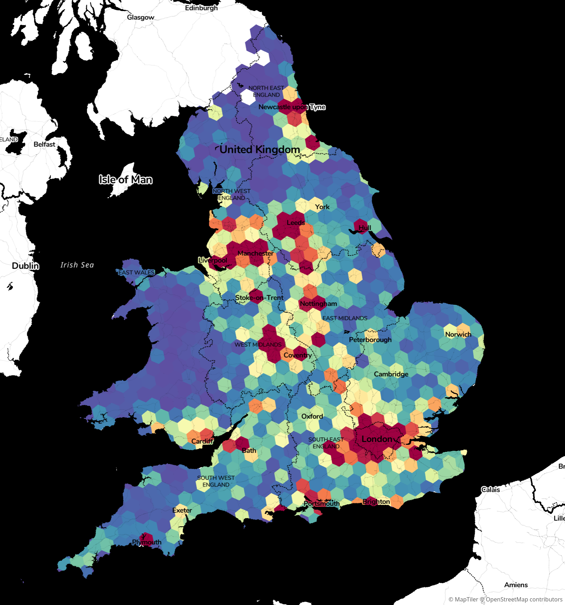

# H3-MON: THE MOST POWERFUL MON(itor) IN THE UNIVERSE

A simple data vis tool using MapLibre GL and deck.gl to display and refresh data from a CSV file.

# How to run

Prerequisites: yarn. A web browser. A CSV file of index, value for [H3 Hexagon indices](https://h3geo.org/).

0. `git clone`
1. `yarn install`
2. bung data in `./www/data/h3_data.csv` with index (hex strings), values normalised from 0-1
3. `yarn serve&; yarn watch`, open localhost:1983
4. update data however you like, it gets refreshed every few seconds
