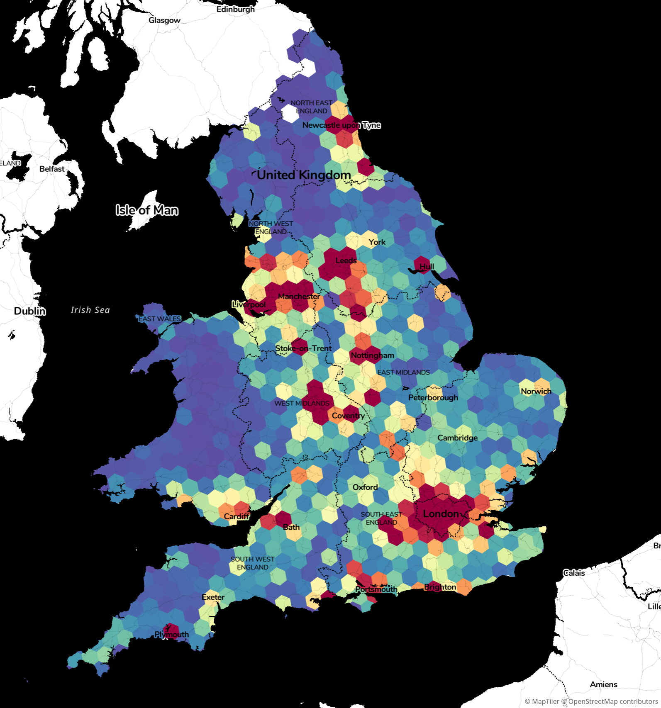

# H3-MON: THE MOST POWERFUL MON(itor) IN THE UNIVERSE

A simple data vis tool using MapLibre GL and deck.gl to display and refresh data from CSV/Arrow/Parquet files. GeoJSON supported experimentally.

<p align="center">

</p>


# How to run

Prerequisites: yarn. A web browser. A CSV file of index, value for [H3 Hexagon indices](https://h3geo.org/).

0. `git clone`
1. `yarn install`
2. bung data in `./www/data/h3_data.{csv, arrow, parquet}` with index (hex strings), values and optionally weights
3. `yarn serve&; yarn watch`, open localhost:1983/?data=h3_data{,.csv, .arrow, .parquet}
4. data will be refreshed with a file watcher


# Example query

```sql
-- clickhouse
select substring(lower(hex(h3)),2) index, count()::Int32 value, weight::Int32 weight from (
 select geoToH3(stop_lat, stop_lon, 5) h3, * from transitous_everything_20260218_stop_times_one_day_even_saner2 t
 left join (
  select h3ToParent(h3, 5) h3_t, sum(population) weight from public_kontur_population_20231101
  group by h3_t
 ) k on k.h3_t = h3
)
group by all
into outfile 'total_stops_weighted.parquet' truncate
```
