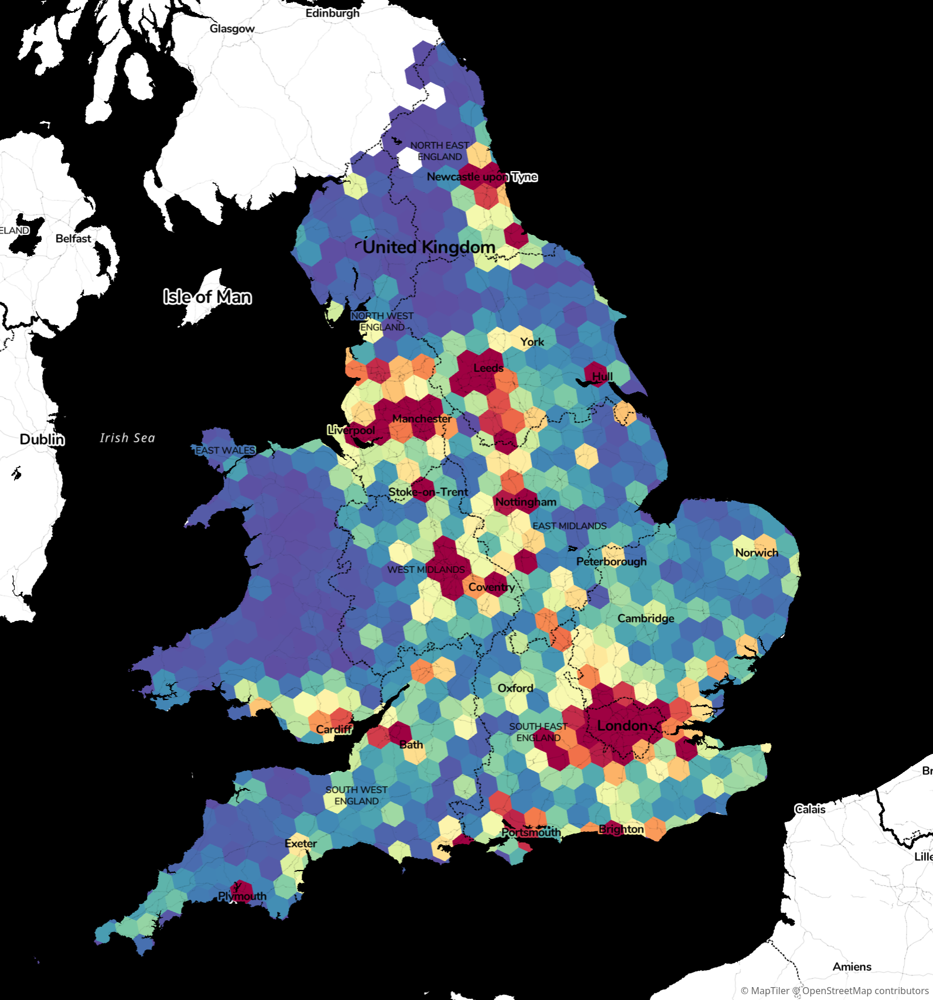

# H3-MON: THE MOST POWERFUL MON(itor) IN THE UNIVERSE

A simple data vis tool using MapLibre GL and deck.gl to display and refresh data from CSV/Arrow/Parquet files. GeoJSON supported experimentally.

<p align="center">

</p>


# How to run

Prerequisites: yarn. A web browser. A CSV file of index, value for [H3 Hexagon indices](https://h3geo.org/).

0. `git clone`
1. `yarn install`
2. bung data in `./www/data/h3_data.{csv, arrow, parquet}` with index (hex strings), values and optionally weights
3. `yarn serve&; yarn watch`, open localhost:1983/?data=h3_data{,.csv, .arrow, .parquet}
4. data will be refreshed with a file watcher

# Metadata and view settings

Initial loads show detailed progress. Reloads keep the current map usable and show
only a delayed corner spinner. Failed requests retain the previous result, with
Retry and expandable error details beside the spinner.

For a data file named `example.arrow`, H3-MON loads metadata from `www/data/example.json`. Query-string values override metadata values, so existing links such as `?data=example.arrow&flip&raw=false` continue to work and views configured in the settings panel can be shared directly.

The cog opens compact groups of labelled controls. Optional explanations are behind
`?`; Reset restores a field's default. Selects and toggles apply immediately. Text
fields that only affect presentation use leading throttle-debounce. Settings that
require a data or cartogram rebuild are staged until **Apply** is pressed; that button
appears only when needed.

**Freeze legend** in Values captures the current legend's numeric minimum and maximum
and switches both panes to a fixed **linear** scale, not a frozen quantile distribution.
Bounds keep their full precision and persist through movement, data requests and shared
URLs. Values outside the bounds use the endpoint colours; equal bounds put that value
at the midpoint. Freezing overrides Raw values, linear, rankit, trim and quantile-source settings until
**Unfreeze legend** restores automatic scaling (or raw 0..1 scaling if enabled).
Freeze captures the currently published legend whenever it has valid numeric bounds,
even while a new result is loading or rendering; it does not capture a scale still being
calculated. New results rescale to the current viewport without requiring an extra map movement.

**Linear colours** (`linear=1`, or `"linear": true` in metadata, default off) uses
empirical percentile endpoints from the selected visible **Quantile source** in both
panes. The existing **Trim fraction** selects the endpoints: `trimFactor=0.01`
means the 1st and 99th percentiles; zero uses the minimum and maximum. Colours are
linear between these values, the legend stays in original units, and outliers clamp
to the endpoint colours. It uses the existing finite-row sample and weighted
quantiles (all-zero weights fall back to unweighted quantiles), without trimming
twice. Singleton/constant endpoints use the midpoint and missing values stay missing.
Bounds refresh after loads, viewport movement and query replay; Freeze legend captures
the displayed percentile endpoints as fixed numeric bounds.

Mode precedence is **frozen bounds > Raw values > Linear colours > Rankit colours >
uniform quantiles**. Toggles remain independent; disabling a higher-priority mode
restores the enabled mode below it.

**Rankit colours** (`rankit=1`, default off) replaces uniform quantiles with normal
scores in both panes, using the selected visible quantile source. Raw and linear modes ignore
rankit. The existing finite-row sample is retained; ties use average ranks. With
weights, positive weights determine midpoint cumulative mass `m`, and the effective
rank is `r = n*m + 1/2`, where `n` is the number of positive-weight sampled rows.
This is invariant to weight units; zero-weight rows do not determine the scale,
and all-zero weights fall back to unweighted ranks.
Blom probabilities `(r - 3/8)/(n + 1/4)` are transformed by the standard-normal
probit. Symmetric finite endpoints at `p = 0.625/(n + 0.25)` (or the trim fraction,
whichever is larger) normalize and clamp scores to 0..1. Singleton/constant data
uses the midpoint. Between sampled values colours interpolate linearly; the legend
inverts these knots to original units, not z-scores. Tails get more colour space,
so colours are less evenly distributed than the default quantiles.

| Key | Name | Type | Description |
|-----|------|------|-------------|
| `t` | Title | string | Browser and legend title; `{TOWN_NAME}` resolves to the nearest city for the displayed query. |
| `c` | Additional attribution | comma-separated string | Attribution names prepended to the standard credits. |
| `colourScheme` | Colour scheme | D3 interpolator name | Continuous D3 colour interpolator, such as `interpolateViridis`. |
| `cyclical` | Cyclical colours | boolean | Uses Rainbow instead of Spectral when no explicit colour scheme is set. |
| `flip` | Reverse colours | boolean | Reverses the colour scale. |
| `raw` | Use raw values | boolean | Colours by source values instead of quantiles. |
| `linear` | Linear colours | boolean, default false | Linear between empirical trim-percentile endpoints; ignored in raw or frozen mode. |
| `rankit` | Rankit colours | boolean, default false | Blom normal-score ranks instead of uniform quantiles; ignored in linear, raw or frozen mode. |
| `legendBounds` | Frozen legend bounds | JSON `[min,max]` or `null` | Fixed linear numeric bounds; `null` restores automatic scaling. |
| `trimFactor` | Legend trim factor | number from 0 to less than 0.5 | Trims quantile legends and selects linear percentile endpoints; default 0.01. |
| `quantileSource` | Quantile source | `map` or `cartogram` | Chooses which visible values determine quantiles. |
| `scale` | Scale labels | object or null | Maps numeric breakpoints to raw legend labels. |
| `trains` | Railway speeds | boolean | Shows OpenRailwayMap maximum-speed tiles. |
| `cartogram` | Cartogram weights | filename, default-like value, or `none` | Selects a weights file or disables the cartogram. |
| `defaultValue` | Missing value | number or null | Fallback used for missing contributors during cartogram aggregation. |
| `infill` | Infill empty cells | boolean | Allows the missing value to fill wholly unobserved cartogram cells. |

Boolean URL values retain the existing accepted forms: bare parameters and most values enable a setting, while `0`, `false`, `off`, and `no` disable it. The settings panel writes explicit `1` or `0` values and preserves unrelated query parameters and the map-position hash.

Example metadata:

```json
{
  "t": "Population change",
  "c": "Example data provider",
  "colourScheme": "interpolateViridis",
  "flip": false,
  "trimFactor": 0.01,
  "quantileSource": "cartogram",
  "defaultValue": 0,
  "infill": true,
  "scale": {
    "0": "No change",
    "1": "Largest increase"
  }
}
```

# Interaction endpoints

Titles may contain `{TOWN_NAME}` (see the reachable example). The legend and browser
tab substitute the nearest city from the bundled `tiny-geocoder` dataset, not an
administrative boundary lookup. They use the last successfully displayed query's
geographic coordinates: the map click, central linked H3 origin for cartogram clicks,
or map centre for `onmove`. Pending, failed and superseded requests retain the displayed
city and selection; a successful `onmove` updates the city and clears the click marker.
Before the first result, or if no city matches, the placeholder stays unchanged.
Static map/cartogram clicks also resolve the title when no endpoint query is needed.
Settings, metadata and shared URLs retain the template, never the substituted city;
replay resolves it only after a successful result, and title edits use the displayed origin.

JSON metadata can optionally define `onclick` and `onmove` objects. By default these
issue **GET requests returning Arrow IPC files or streams**; an optional `socket`
selects the [query WebSocket protocol](docs/query-websocket.md) instead. Both replace
the current dataset using the existing map, legend, tooltip and cartogram rendering
pipeline. Hook URLs are templates; optional input converters described below are
trusted JavaScript. No query WebSocket backend implementation is included.

- `onclick` uses the geographic cell under a map click/tap, including cells absent
  from the current result. Cartogram clicks use a central cell from the linked H3
  set, with deterministic ties; the configured request resolution is then applied.
- `onmove` uses the geographic map centre during user pan/zoom, including keyboard
  navigation. It is not pointer hover. Programmatic camera changes, including search,
  hash navigation and cartogram synchronization, do not request data.
- With positive `wait`, movement uses leading throttle-debounce, including the latest
  position after a quiet period. `wait` is milliseconds, default `350` for HTTP and
  `0` for WebSocket; `0` bypasses this scheduling. Unchanged automatic query contexts
  are deduplicated. A configured click cancels pending movement delivery and always
  requests a fresh result.
- `onmove` applies to the geographic map only. Cartogram panning keeps its existing
  navigation behavior without issuing requests through programmatic map synchronization.
- Enabled `onmove` shows a thin grey crosshair at the geographic map centre, matching
  the movement query origin. Set global metadata `"crosshair": false` to hide it
  (`true` is the default), or use **Centre crosshair** in Settings. URL overrides
  `crosshair=0` and `crosshair=1` are shareable. The crosshair remains hidden when
  `onmove` is disabled or absent and never intercepts map gestures.
- New HTTP requests cancel obsolete fetches. WebSocket movement can display a trailing
  result while newer work is pending; explicit query-context changes invalidate old
  results without sending cancellation to the server. Failed requests retain the last good dataset
  and show an error in the loading status. Settings refreshes use the last successful
  endpoint, rather than reverting to the seed file. Seed-file watcher events are ignored
  once an endpoint result is active. Browser cancellation does not cancel server work.

Each object requires `url`. Optional `resolution` is an integer from 0 to 15; otherwise
the current dataset's H3 resolution is used. `wait` must be between 0 and 60000.
`onclick.focus` and `onclick.highlight` are independent booleans, both defaulting to
`true`. Set `focus: false` to keep the camera in place while still marking the origin;
set `highlight: false` to hide selection in both panes without disabling camera focus
or requests. Geographic clicks mark the resolved query H3 cell, even if absent from
the response; cartogram clicks mark the selected square and its linked geographic cells.
The marker tracks the last successfully displayed result, not pending, failed or
superseded clicks. A successful movement result clears the click marker. Shared-query
replay and settings refreshes restore selection without focusing the camera, including
when automatic requests are disabled. Static datasets still select immediately.

URL templates support these placeholders, with substituted values URL-encoded:

| Placeholder | Value |
|-------------|-------|
| `{index}` | Canonical hexadecimal H3 cell at the selected resolution. |
| `{index_lower}`, `{index_upper}` | Unsigned low/high 32-bit words of that cell. |
| `{lat}`, `{lng}` | Click location or current map-centre coordinates. |
| `{zoom}` | Current geographic map zoom. |

URLs must use HTTP(S), without embedded credentials. Relative URLs resolve against
the page URL. Existing query parameters are preserved; no cache-busting `v` parameter
is added to endpoint URLs. Missing, null or false hooks are disabled; `?onmove=false`
also disables a metadata hook. Structured hooks are metadata-only, not settings-panel
controls or JavaScript/JSON strings in query parameters.

For WebSocket queries, add an absolute `socket` such as `wss://api.example.com/query`
to either hook. Keep `url` as an HTTP(S)-style template: only its resolved path and
query string are sent to the socket server, not its origin. Matching `onclick` and
`onmove` socket endpoints reuse one connection. See the [protocol specification](docs/query-websocket.md)
for binary framing, server scheduling, retry/lifetime behavior, sharing and security.

## Rail-routing example

[`www/data/reachable.json`](www/data/reachable.json) configures request controls for the
res5 router in the sibling `gtfs_ffs` project. It currently uses click-only queries and
a seven-day default budget. [`reachable.csv`](www/data/reachable.csv)
is only a one-cell seed near Paris, not a precomputed reachability result. With that
backend listening on port 1988, run `yarn build` and `yarn serve`, then open:

```text
http://localhost:1983/?data=reachable.csv#x=2.3962&y=48.8241&z=6
```

Click/tap a cell or edit a request control to fetch the first result. If `onmove` is
configured, panning also requests data; `&onmove=false` disables that automatic delivery.
An initial link without a saved query loads the seed. A shared query link replays the
query instead. The essential metadata shape is:

```json
{
  "t": "Rail travel time (hours)",
  "raw": false,
  "cartogram": "none",
  "controls": {
    "travelTime": {
      "label": "Travel time",
      "type": "number",
      "unit": "h",
      "default": 3,
      "min": 0,
      "max": 168,
      "step": 0.25
    },
    "departure": {
      "label": "Departure",
      "type": "number",
      "unit": "h",
      "default": 8,
      "min": 0,
      "max": 23.9999997,
      "step": 0.25
    }
  },
  "onclick": {
    "url": "http://127.0.0.1:1988/reachable?index={index}&departure_h={controls.departure}&budget_h={controls.travelTime}&encoding=split",
    "resolution": 5,
    "focus": false,
    "highlight": true
  },
  "onmove": {
    "url": "http://127.0.0.1:1988/reachable?index={index}&departure_h={controls.departure}&budget_h={controls.travelTime}&encoding=split",
    "resolution": 5,
    "wait": 350
  }
}
```

Edit departure time and budget in Settings; valid edits automatically rerun the last
origin after a short pause. Before any query, the map centre is used. `127.0.0.1` means
the **browser's machine**: replace it with your reachable backend hostname or use a
port forward when browsing remotely. HTTPS pages require an HTTPS endpoint or proxy.
The endpoint must allow CORS when served from another origin.

The routing response must include `value` (elapsed hours for `metric=time`), plus string
`index` or unsigned split indices; `elapsed_h` is displayed in the tooltip as an extra column.
Keep Arrow IPC uncompressed and string columns non-dictionary-encoded for the installed
reader. `raw: false` gives quantile colours with hour-valued legend labels; raw mode
expects values already scaled to 0..1. Res5 routing merges stops within each cell and
does not imply that every point inside a returned cell is reachable.

The router's breaking hour-based API uses `departure_h`, `budget_h`, `window_h`,
`step_h` and `max_walk_h`, without clock-string or seconds aliases. Numeric controls
send hours directly; old saved minute-valued control overrides must be replaced.
Window responses include only cells reachable from **every** sampled departure,
filtered before distance/time ranks. `reachable_elapsed_h` is also hours;
`distance_km` remains kilometres, and quantiles and coverage fractions are dimensionless.
For `metric=distance_time_quantile`, `value` and its legend are rank differences,
not travel hours. Set the title accordingly when selecting that metric.

## Request controls and shared links

`controls` is an object keyed by field IDs (letters, digits and underscores, starting
with a letter). Each field requires `label`, `type` and `default`. Supported types are
`number`, `time`, `text`, `select` and `boolean`. Optional `unit` appears in the label;
`help` supplies contextual help. Numbers and times accept `min`, `max` and a native
input `step`. Selects require `options: [{"value": "rail", "label": "Rail"}]`.

An optional `encode` function expression receives `(value, values)`: the field's
typed input and a frozen map of all raw control values. It must return a string,
finite number or boolean synchronously. `{controls.<id>}` in either hook URL uses
that converted value, URL-encoded. Invalid inputs and failed conversions do not send
a request. Request controls share a 350 ms trailing debounce and have no Apply button.

**Trust boundary:** converter expressions are compiled from the fetched metadata and
run with the page's JavaScript privileges. They are not sandboxed. Only publish metadata
you trust as application code; hosting CSP must permit this compilation. URL parameters
and user-entered values are always data, never code, and cannot supply converter definitions.

The URL stores raw input values as `p.<id>`, independently of built-in view settings.
It also records a validated `query` JSON object containing the hook event, resolved H3,
coordinates and query zoom (plus cartogram click coordinates when applicable). Copy the
URL to restore the same query in a fresh browser without local storage or earlier clicks.
The dataset metadata and endpoint must still be accessible to that browser.

Replay and parameter edits use the declared endpoint even if its automatic hook is
disabled by `onclick=false` or `onmove=false`. They preserve the saved geographic camera
(`x`, `y`, `z`, `b` bearing and `p` pitch in the hash), rather than replaying click-focusing
animations. Explicit clicks always refresh; unchanged automatic requests are deduplicated.

# Tests

H3-MON intentionally uses its own controls and styles, not MapLibre's stylesheet.
The rendering test guards that setup as well as overlay alignment and blending.

`yarn test` runs the unit tests. For the headless rendering regression tests:

```sh
yarn playwright install chromium
yarn test:rendering
```

The rendering tests check multiply-blended pixels, polygon edges, and Deck/MapLibre
alignment against an in-memory basemap on desktop and mobile, including rotated,
pitched and resized views. Separate fixtures cover rankit/frozen scaling and independent
focus/highlight controls, including selection pixels in both panes, pending/failed and
superseded requests, Retry, settings refreshes and shared-query replay.
They need no backend or external tiles. `CHROMIUM_PATH`
can select an existing Chromium executable; `ARTIFACT_DIR` optionally retains
diagnostic screenshots.

# Cartogram mapping spec

Cartograms are maps with complex projections, most commonly used for visualising data with uniform populations rather than geographic projections which attempt to preserve land area.

Creating such a projection is a non-trivial task. Our approach can be found in https://github.com/bovine3dom/population-cartogram-projection but generally the workflow is:

1) find some data that you want to represent uniformly (e.g. population) split by some spatial unit (e.g. country)
2) by hand(!), create a pixel grid layout of the data where each cell is assigned to a spatial unit and the total number of cells is equal to the 'population' of that spatial unit
3) create an H3 representation of the spatial units and join it with a high resolution representation of the 'population'
4) use an algorithm to find the optimal fuzzy matching from H3 to the pixel grid. the best algorithm to use is an open question - we are currently using optimal transport with soft constraints.

Here, we support the following representation of such a mapping of many H3 -> many cells:


| Column | Type   | Description |
|--------|--------|-------------|
| `x`    | int    | column position, origin at top-left of screen |
| `y`    | int    | row position, origin at top-left of screen |
| `index_lower` | uint32 | H3 index, lower 32 bits|
| `index_upper` | uint32 | H3 index, upper 32 bits |
| `index`| string | H3 index, optional instead of split ints |
| `code` | int | country / subdivision code for border rendering |
| `label`| string | optional label text displayed on the cartogram cell |
| `weight`| float | weight for aggregation — `groupby(x, y)` weights should sum to 1 |

`x` increases to the right, `y` increases downward.

An excerpt of a possible `cartogram.arrow` follows:

```
    ┏━━━━━┳━━━━━┳━━━━━━━━━━━━━━━━━━━━━━┳━━━━━━━━━━━┳━━━━━━┳━━━━━━━━━━━━━━━━━┓
    ┃   x ┃   y ┃               weight ┃ label     ┃ code ┃ index           ┃
    ┡━━━━━╇━━━━━╇━━━━━━━━━━━━━━━━━━━━━━╇━━━━━━━━━━━╇━━━━━━╇━━━━━━━━━━━━━━━━━┩
 1. │ 354 │ 114 │                    1 │ Reykjavík │  352 │ 85075dd7fffffff │
    ├─────┼─────┼──────────────────────┼───────────┼──────┼─────────────────┤
 2. │ 388 │ 278 │   0.1995755129563892 │ ᴺᵁᴸᴸ      │  620 │ 85393363fffffff │
    ├─────┼─────┼──────────────────────┼───────────┼──────┼─────────────────┤
 3. │ 388 │ 278 │   0.1995755129563892 │ ᴺᵁᴸᴸ      │  620 │ 85393363fffffff │
    ├─────┼─────┼──────────────────────┼───────────┼──────┼─────────────────┤
 4. │ 386 │ 284 │   0.1995755129563892 │ ᴺᵁᴸᴸ      │  620 │ 85393363fffffff │
    ├─────┼─────┼──────────────────────┼───────────┼──────┼─────────────────┤
```

Then, provided you have data in `csv` or `arrow` format (not parquet), the client will automatically load the data into both the standard map and cartogram. At the time of writing, H3 is aggregated into cells using weighted means, but weighted sums could be supported with a few lines of code.

# Example query

```sql
-- clickhouse
select substring(lower(hex(h3)),2) index, count()::Int32 value, weight::Int32 weight from (
 select geoToH3(stop_lat, stop_lon, 5) h3, * from transitous_everything_20260218_stop_times_one_day_even_saner2 t
 left join (
  select h3ToParent(h3, 5) h3_t, sum(population) weight from public_kontur_population_20231101
  group by h3_t
 ) k on k.h3_t = h3
)
group by all
into outfile 'total_stops_weighted.parquet' truncate
```

```sql
-- clickhouse
select * except (index, h3) from (
    select *, reinterpretAsUInt64(reverse(unhex(index))) h3,
    toUInt32(bitAnd(h3, toUInt64(4294967295))) as index_lower,
    toUInt32(bitShiftRight(h3, 32)) as index_upper
    -- bitOr(toUInt64(index_lower), bitShiftLeft(toUInt64(index_upper),32)) -- validation
    from 'cartogram_weights.arrow'
)
into outfile 'cartogram_weights_hilo.arrow' settings output_format_arrow_compression_method = 'none'
```

```julia
#/bin/julia
loweruint64(x) = x % UInt32
upperuint64(x) = (x >> 32) % UInt32
```
